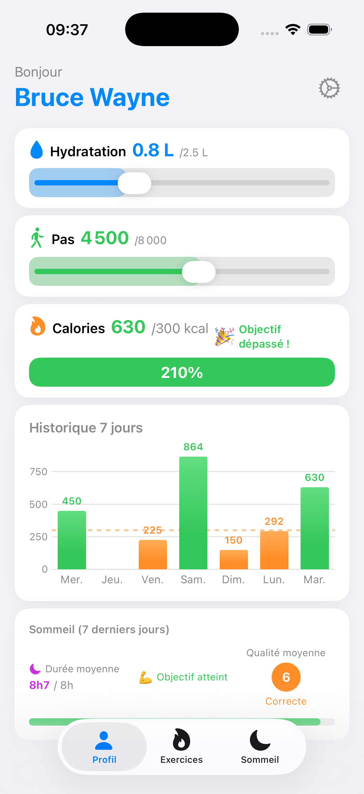
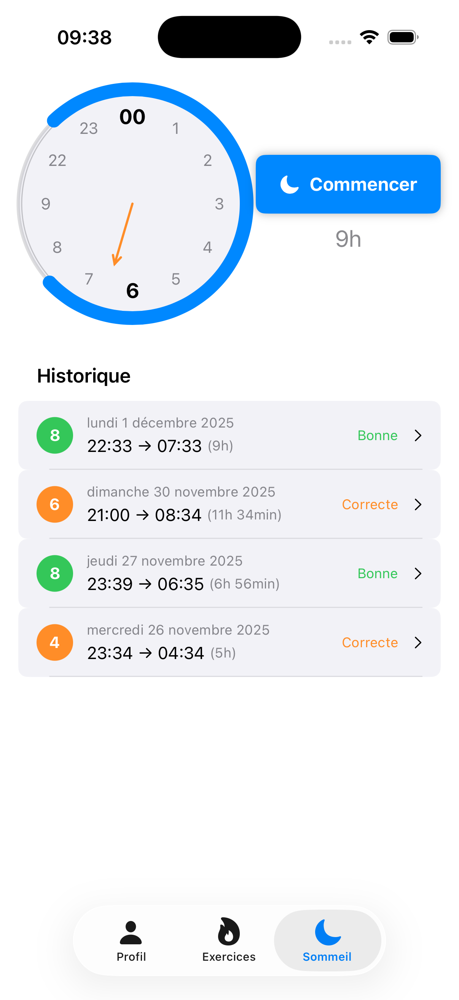
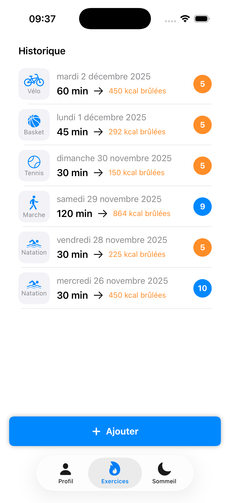

Arista

A simple, private, on-device health tracking app for iOS.

✨ Overview

Arista is a lightweight, privacy-first iOS application for daily health tracking.
All data is stored locally using Core Data — no accounts, no servers, no network connection required.

Tracks:

🔥 Calories

💧 Water intake

🚶 Steps & activity

😴 Sleep duration

Designed with a clean and maintainable architecture using MVVM and an AppCoordinator.

📸 Screenshots

Below are a few screenshots showcasing the main modules of Arista.

🏠 Dashboard (UserView)

😴 Sleep Tracking

🏃 Exercise & Activity

🧱 Architecture
🧭 MVVM + Coordinator

AppCoordinator manages navigation, login/logout, user deletion, and ViewModel creation.

Each feature has its own ViewModel and Data Manager.

💾 Core Data

Local persistence via NSPersistentContainer

Three environments:

Production

Demo (preloaded demo user)

Unit tests (in-memory)

📦 Data Managers

UserDataManager

GoalDataManager

SleepDataManager

ExerciseDataManager

Ensures modularity, clarity, and testability.

🎯 Features
👤 User

Create, edit, delete a local user

Session restoration

Secure logout

🎯 Goals

Daily calories, water, steps & activity objectives

😴 Sleep

Daily sleep tracking & progress

🏃 Activity

Steps & movement tracking linked to goals

🔒 Privacy

100% offline

No analytics, no tracking, no cloud

🧩 Targets

Arista — main production app

AristaDemo — automatically loads a demo user

AristaTests — uses an isolated Core Data in-memory stack

🧪 Unit Tests

Covers:

AppCoordinator (login, logout, delete, restore)

Data Managers (User, Goal, Sleep, Exercise)

ViewModels (User, Sleep, Exercise)

All tests use an in-memory store for speed and safety.

📂 Project Structure

Arista/
├── App/
├── Models/
├── DataManagers/
├── ViewModels/
├── Views/
└── Tests/

🚀 Installation

Clone the repository:

git clone https://github.com/your-username/arista.git

cd arista
open Arista.xcodeproj

Select the target you want to run:

Arista

AristaDemo

AristaTests

📜 License

This project is released under the MIT License.

👨‍💻 Author

Developed by Julien Cotte — Junior iOS Developer passionate about clean architecture, Core Data, and privacy-focused apps.
